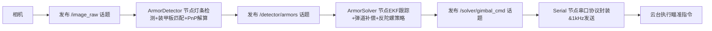

# RM Auto Aim README

基于 ROS2 开发的 RoboMaster 自动瞄准（Auto Aim）系统，集成装甲板检测、目标跟踪、弹道补偿、反陀螺策略及串口通信等核心功能，模块化设计便于扩展与调试，项目结构如下：

```text
auto-aim/src/
├── rm_interfaces/          # 自定义消息与服务
│   ├── msg/                # Armor, Armors, Target, GimbalCmd 等消息
│   └── srv/                # SetMode 等服务
├── rm_auto_aim/            # 核心算法包
│   ├── detector/           # 识别模块
│   │   ├── types.hpp       # 灯条/装甲板数据结构 + 检测参数
│   │   ├── detector.*      # 灯条检测 + 装甲板匹配逻辑
│   │   ├── pnp_solver.*    # PnP 三维坐标解算
│   │   └── armor_detector_node.*  # 识别模块 ROS2 节点
│   └── solver/             # 解算模块
│       ├── extended_kalman_filter.*  # 10维扩展卡尔曼滤波(EKF)
│       ├── armor_tracker.*          # 跟踪状态机实现
│       ├── trajectory_compensator.hpp  # 弹道补偿算法
│       └── armor_solver_node.*      # 解算模块 ROS2 节点
├── rm_hardware_driver/     # 硬件驱动包
│   ├── fixed_packet.hpp    # 定长串口协议包定义
│   ├── serial_driver_node.*  # 串口通信节点（与云台/电控交互）
│   └── camera_driver_node.*  # 通用相机驱动节点
├── rm_bringup/             # 启动配置包
│   ├── launch/bringup.launch.py  # 系统完整启动文件
│   └── config/node_params/       # 各节点参数配置（YAML）
└── rm_robot_description/   # 机器人URDF模型描述
```

编译与运行指令如下，执行前需进入项目工作空间根目录，编译支持配置文件热更新，加载环境变量后即可启动整套系统：

```bash
# 进入工作空间根目录
cd ~/auto-aim
# 编译（--symlink-install 支持配置文件热更新，无需重复编译）
colcon build --symlink-install
# 加载ROS2环境变量（每次新开终端需执行）
source install/setup.bash
# 启动整套自动瞄准系统（包含所有节点）
ros2 launch rm_bringup bringup.launch.py
```

系统核心数据流形成闭环，从相机采集图像到云台执行瞄准指令的完整流程为：

```text
Camera → /image_raw → ArmorDetector → /detector/armors → ArmorSolver → /solver/gimbal_cmd → Serial
                        (灯条检测      (EKF跟踪+预测
                         装甲板匹配     弹道补偿
                         PnP解算)       反陀螺策略)
```

数据流可视化如下：



系统核心功能涵盖各关键环节，具体包括：灯条检测通过灰度转换→二值化→轮廓提取→旋转矩形拟合→长宽比/角度/颜色多维度筛选实现；装甲板匹配依靠灯条对间距比、连线角度、长度比约束及包含关系检查筛选有效装甲板；PnP解算采用solvePnP(IPPE_SQUARE)求解双解，通过重投影误差择优确定目标三维坐标；EKF跟踪基于10维状态量（旋转中心+速度+yaw+角速度+半径），通过数值雅可比实现滤波预测；状态机支持LOST→DETECTING→TRACKING↔TEMP_LOST状态切换，适配掉帧/短暂丢失场景；弹道补偿采用抛物线+空气阻力模型，迭代求解发射仰角以补偿目标距离带来的弹道下坠；反陀螺基于角速度判断陀螺旋转状态，选择正对相机的装甲板作为瞄准点；串口通信采用定长协议包[0xFF][data][XOR校验][0x0D]，以1kHz高频发送云台控制指令，保证控制实时性与稳定性。

关键配置需注意：相机内参是PnP解算精度的核心，需根据实际相机标定结果，修改auto-aim/src/rm_bringup/config/node_params/camera_driver_params.yaml文件中的内参矩阵（camera_matrix）和畸变系数（distortion_coefficients）。


整体而言，该项目基于ROS2模块化设计，核心分为识别、解算、硬件驱动三大模块，通过自定义消息实现模块间解耦通信，核心启动入口为bringup.launch.py，相机标定参数直接影响PnP解算精度，系统包含完整的跟踪状态机和弹道补偿逻辑
